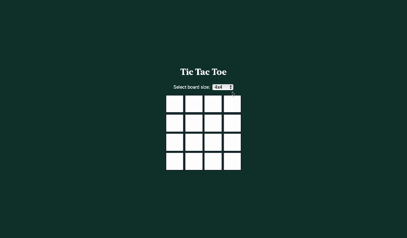

# Tic-Tac-Toe
A simple implementation of the Tic-Tac-Toe game as outlined [here](https://en.wikipedia.org/wiki/Tic-tac-toe)

## Gameplay
Both players play out of the same application, the play switches between players each time a move is played. The board can be scaled between sizes 3x3 and 15x15 as specified by the user before the game begins. Once the game is completed, you can start another game. 
The player stats are stored and displayed. 

## Setup guide
### To start the game
- Make sure you have **node** installed
- `cd client`
- `npm i`
- `npm start`
### To start the server
- `cd server`
- `node server.js`

## Implementation
The front end and logic of the game is written in `Typescript` with `React`, using `Tailwind` for styling. The results of the game are stored in a `MySql` database which is served with a `node.js` server. 

## Time restrictions
There is very minimal error-checking, for example if the server is not running then the react app will crash. There is also no testing, an optimal solution would contain both unit tests and integration tests. 